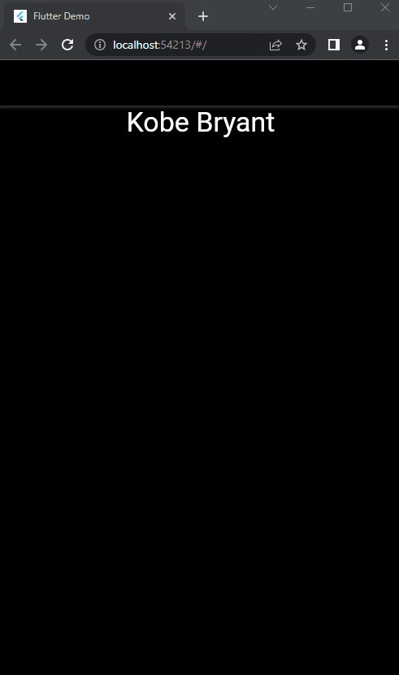
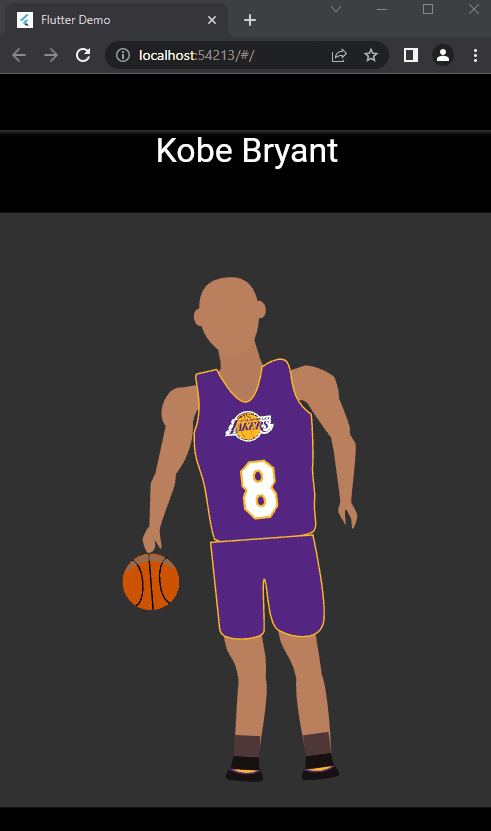

# Favorite-Celebrities-Flutter-HS-Demo

Basic Flutter App/Website to show HS students that coding is cool!

## Screenshot

## Structure

* The app has been divided into steps.
* Each step has starter and solution code.
* You can access each code set using the respective branches.
* Also, each step has detailed TODOs along with explanations on why we're doing each TODO.

### How to follow this repo?

* Complete the given TODOs in order.
* Compare the starter and solution branches for each step. You can do this on GitHub or in Android Studio/VS Code.

[How to compare branches on GitHub](https://docs.github.com/en/free-pro-team@latest/github/committing-changes-to-your-project/comparing-commits#comparing-branches)

[How to compare branches on Android Studio](https://medium.com/better-programming/how-to-use-git-in-android-studio-part-2-93cec67b91b0#:~:text=Go%20to%20%E2%80%9CVSC%E2%80%9D%20%2D%3E,choose%20%E2%80%9CCompare%20with%20current%E2%80%9D.&text=A%20popup%20%E2%80%9CCompare%20feature%20with,to%20commits%2C%20files%20to%20files.)

[How to compare branches on Android Studio](https://stackoverflow.com/a/57833947/11547064)

### Steps

1. Basic Structure 

2. Show names 

3. Basic Anim 

4. Anim Switches 
